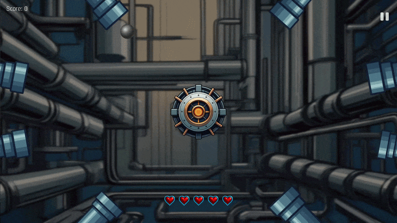

# Pipe Pulse

A 2D arcade defense game built using Java and Processing.

In Pipe Pulse, pipes continuously pulse and launch balls towards the centre of the screen. The player's objective is to destroy the incoming balls before they reach the centre.

## Gameplay

## Features

- 10 levels with progressive difficulty
- Endless game mode
- User login and account system
- Persistent leaderboard
- Level progression and unlocking
- Dynamic enemy spawning
- Collision detection
- OOP-based enemy system
- Database storage for player progress and scores
- Animated game elements and UI

## Controls

- **Mouse** — Destroy incoming balls

## Technologies

- **Java**
- **Processing**
- **SQLite**

## Project Structure

The game is organised into separate classes and screens to manage different aspects of the application.

- `GameManager.pde` — Core game logic and game state management
- `GameLevel.pde` — Level configuration and progression
- `GameBall.pde` — Incoming ball behaviour
- `Pipe.pde` — Pipe mechanics
- `Database.pde` — SQLite database operations
- `ScreenGame.pde` — Gameplay screen
- `ScreenLevels.pde` — Level selection and unlocking
- `ScreenLogin.pde` — User authentication
- `ScreenLeaderboard.pde` — Persistent leaderboard
- `AppManager.pde` — Application and screen management

## Database

SQLite is used to persist:

- Player accounts
- Scores
- Level progression
- Leaderboard data

## Object-Oriented Design

The project uses object-oriented programming principles to structure the game. Game functionality is separated into dedicated classes for gameplay, screens, UI components, database management, pipes and incoming balls.

## Running the Game

1. Install [Processing](https://processing.org/)
2. Clone this repository
3. Open `PipePulse.pde` in Processing
4. Ensure the required assets and libraries are available
5. Run the sketch

## Project

This project was developed as a Java/Processing game project to explore object-oriented programming, game development, user authentication, database integration and persistent game progression.
